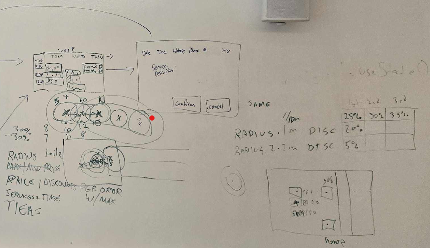
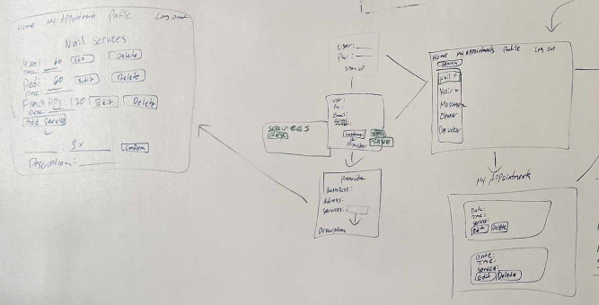
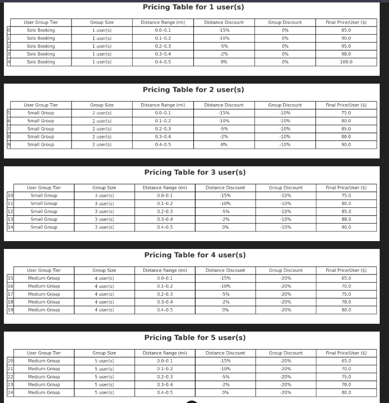
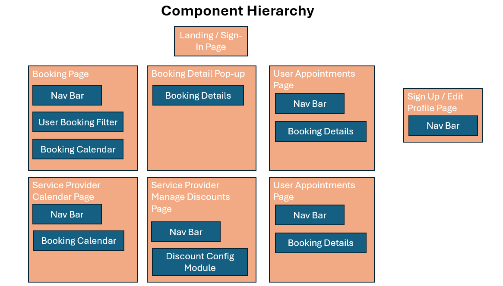
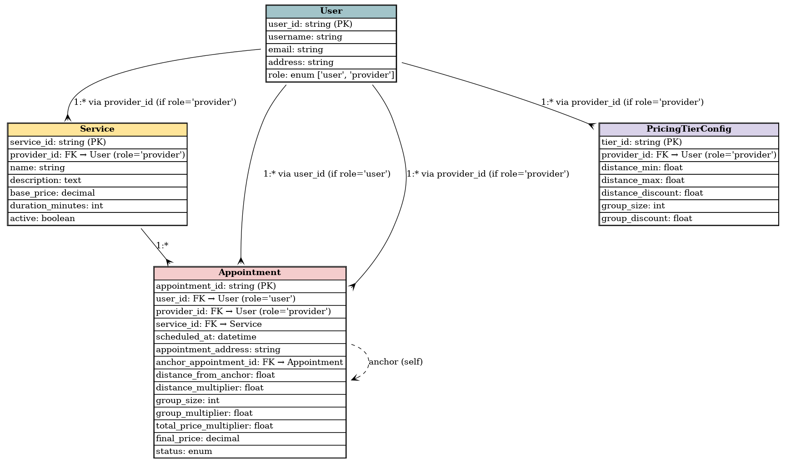

# Viciniti

## Project Description

### Our application is called Viciniti. It matches users who consume delivered services and products with corresponding providers in a way that facilitates piggybacking multiple deliveries together in order to create efficiencies and cost savings for both parties and drive more sales for the providers.

## Application Description

The purpose of the application is to make the delivery of products and services to consumers more efficient by generating orders/appointments that are grouped closely toghther geographically. We do this by pushing disount options to users based on their proximity to existing orders/appointments with a given service/product provider. This allows the providers to generate more business while reducing delivery costs and it allows users to get better pricing.

## User Stories

### MVP Goals

#### For Users
- **Create User Account**
    - As a User, I want to be able to create an account, so that I can save my preferences and personal information.
- **User Log In**
    -As a user, I want to be able to log in to my account, so that I can manage my account and make and manage appointments.
- **View User Profile Details**
    - As a User, I want to be able to view my account details, so that I can know that my account information is accurate.
    - This page can be the same as the create account page, but the fields will be populated with the users saved information and they can edit and resave each field.
- **Edit User Profile Details**
    - As a User, I want to be able to edit my account details, so that I can update any details if they change or fix any errors.
- **Delete User Account**
    - As a User, I want to be able to delete my account, so that I can protect my data and reduce spam communications if I choose to no longer use this application.
    - This feature will be included on the edit account page, it just adds a delete button.
- **Search Available Appointments**
    - As a User, I want to be able to view options for different appointments I can make by filtering a calendar for different types of services
- **View Appointment Details & Confirm Appointment**
    - As a User, I want to be able to view the details of a particular appointment and confirm the appoinment booking.
- **View & Cancel Appointments**
    - As a User, I want to be able to view a list of my appoinment bookings and cancel any appointments from the list.
- **Change Appointments**
    - As a User, I want to be able to change an existing appointment by being taken to the appoinment search calendar filtered for the Service Provider for my existing appointment and when I select and confirm a new appointment my old one is cancelled.
- **Get Discounts**
    - As a User, I want to get discounts on the services I book based on other users within a certain radius booking services with the same Service Provdier.  I want to see those discounts reflected in the prices as part of the appointment booking options.

 #### For Service Providers
- **Create Service Provider Account**
    - As a Service Provider, I want to be able to create an account, so that I can save my preferences and service offering information.
- **Service Provider Log In**
    -As a Service Provider, I want to be able to log in to my account, so that I can manage my account, service offereings and appointments.
- **View Service Provider Profile Details**
    - As a Service Provider, I want to be able to view my account details, so that I can know that my account information is accurate.
    - This page can be the same as the create account page, but the fields will be populated with the users saved information and they can edit and resave each field.
- **Edit Service Provider Profile Details**
    - As a Service Provider, I want to be able to edit my account details, so that I can update any details if they change or fix any errors.
- **Delete Service Provider Account**
    - As a Service Provider, I want to be able to delete my account, so that I can protect my data and reduce spam communications if I choose to no longer use this application.
    - This feature will be included on the edit account page, it just adds a delete button.
- **View, Add, Edit & Delete Service Offerings**
    - As a Service Provider, I want to be able to view the list of services I'm offering and add or remove services and update the service pricing and time 
- **View & Edit Discount Parameters**
    - As a Service Provider, I want to be able to enter and edit the parameters for the discounts I offer on my services with inputs to set the distances from existing bookings, number of additional customers booked, and discount %.

### Stretch Goals
- **Email Push Notifications**
    - As a User, I want to receive push notification emails anytime there is a new discount available to me in a category that I'm subscribed to.
-**Service Provider Managing Multiple Employees**
    - As a Service Provider, I want to be able to manage appointments for multiple employees at the same time using a separate calendar for each.
- **Support Chat Function**
    - As a User, I want to be able to chat with the Service Providers and customer service about my appointments and any issues that arise.
- **Tracker Map**
    - As a user, I want to be able to track where service providers are on a map so I can see if they are arriving as scheduled.
- **Analytics Module**
    - As a Service Provider, I want to be able to track certain KPIs so that I can understand how my business is performing, how this application is helping my business, and how I should tweak my service and discount offerings to better optimize my profitability.
- **Specific Employee Booking**
    - As a user, when a Service Provider has multiple employees, I want to be able to select a specific one to book so that I can get service for my preferred individual.

## Wire Frames

## Component Hierarchy Diagram

## Entity Relationship Diagram (ERD)

## Timeline

| Day        |   | Task                               | Blockers | Notes/ Thoughts |
|------------|---|------------------------------------|----------|-----------------|
| Thursday   |   | Create and present proposal        |          |                 |
| Friday     |   | Create Auth, Routes, Components    |          |                 |
| Saturday   |   | Integrate Front & Back Ends        |          |                 |
| Sunday     |   | Work on Python / React / Styling   |          |                 |
| Monday     |   | Work on Python / React / Styling   |          |                 |
| Tuesday    |   | Test and finalize MVP              |          |                 |
| Wednesday  |   | Work on stretch goals              |          |                 |
| Thursday   |   | Final testing and styling          |          |                 |
| Friday     |   | Present                            |          |                 |
# viciniti-front-end
  
 

# Viciniti 

## Auth & Role Setup

| Route | Method | Description | Access |
|-------|--------|-------------|--------|
| `/api/signup` | POST | Create a new user and select role (customer or provider) | Public |
| `/api/login` | POST | Authenticate user and return role info | Public |
| `/api/logout` | POST | Log out user | Authenticated |
| `/api/user` | POST | Provider completes business profile after signup | Authenticated  |

---

## Services

| Route | Method | Description | Access |
|-------|--------|-------------|--------|
| `/api/services` | GET | Customer: get all available services (e.g., Nails, Hair, Cleaning) | Authenticated |
| `/api/services` | POST | Provider creates a new service | Authenticated (Provider) |
| `/api/services/:id` | PUT | Provider edits their own service | Authenticated (Provider) |
| `/api/services/:id` | DELETE | Provider deletes their own service | Authenticated (Provider) |

---

## Appointments

| Route | Method | Description | Access |
|-------|--------|-------------|--------|
| `/api/appointments` | GET | Customer: view own appointments Provider: view all appointments booked with them | Authenticated |
| `/api/appointments` | POST | Customer books (confirms) a new appointment | Authenticated (Customer) |
| `/api/appointments/:id` | PUT | Customer edits their own appointment | Authenticated (Customer) |
| `/api/appointments/:id` | DELETE | Customer cancels their own appointment | Authenticated (Customer) |
| `/api/appointments/available?service_id=123` | GET | Return available time slots for the selected service | Authenticated (Customer) |